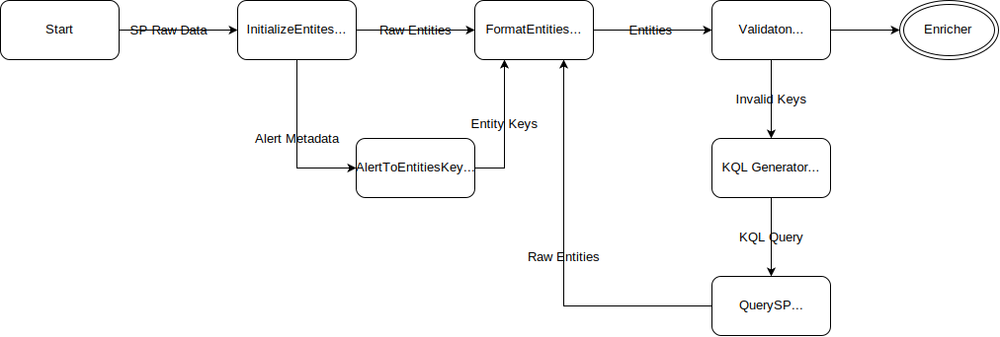

# Pre-Processing Architecture - Mandatory Modules

## General TODO
1. Unit Tests
1. Proper Logging
1. Folder structure
1. Documentation

## Logging
Info - Steps

DATE: FILE: Level: Log message

## InitializeEntities

This is the component necessary to connect data from the Alerter to DataHawk. It queries the Alerter for a specific alert ID, and initializes the `Entities` object.

### Objectives
#### Sentinel
- Fetch alert by ID
- Retrieve alert metadata
    1. Title
    2. Customer
    3. Timestamps
    4. Severity
- Retrieve alert entities
- Retrieve event entities when possible

#### MDE
- Fetch alert by ID
- Retrieve alert metadata
    1. Title
    2. Customer
    3. Timestamps
    4. Severity
- Retrieve alert entities
- Retrieve event entities when possible

#### DarkTrace
- Fetch alert by ID
- Retrieve alert metadata
    1. Title
    2. Customer
    3. Timestamps
    4. Severity

### Completion

## FormatEntities

## ValidationProcedure

